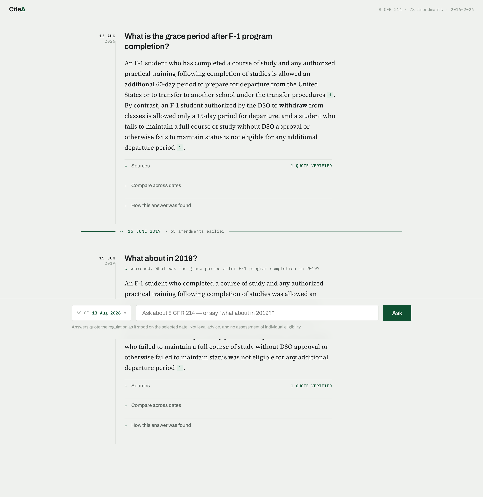
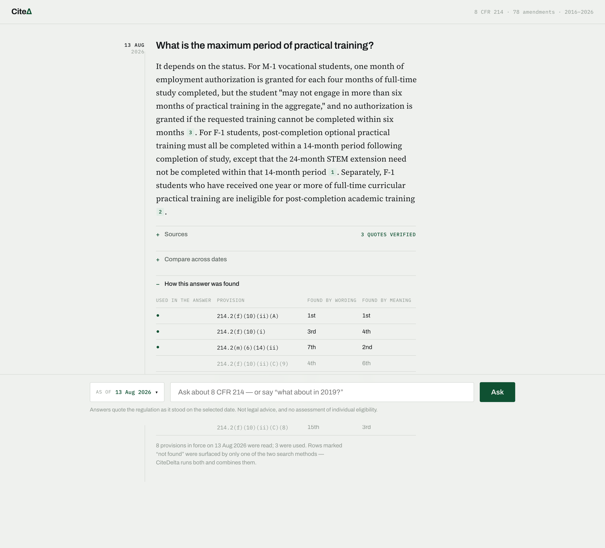

# CiteDelta

Bitemporal hybrid search over US immigration regulations. Ask a question, get an
answer with citations you can verify — **as the regulation stood on any date
since 2016**.



Every index, the queue, the fusion, and the temporal filtering are hand-written.
No vector database, no LangChain, no ORM.

## What it does

- **Time travel.** Any as-of date. Retrieval is filtered *inside* the index, not
  after it — post-filtering collapses at this corpus's ~2% selectivity, and
  [03-benchmarks.md](docs/design/03-benchmarks.md) has the measurement.
- **Cite or refuse.** Every citation is checked against the retrieved set and
  the admissible set. One bad citation discards the whole answer.
- **A visible trace.** Every candidate the retriever considered, both retrievers'
  ranks, the fused score — including the ones that weren't cited.



## Try it

```bash
uv run citedelta serve
open http://127.0.0.1:8000
```

The canonical demo query is **"Can an F-1 student transfer to another school?"**
compared across two dates — the transfer procedure was rewritten in the 2020s to
require the SEVIS transfer-release-date process and successor-form language:

- [`/compare?query=Can%20an%20F-1%20student%20transfer%20to%20another%20school%3F&left=2016-12-31&right=2026-08-11`](http://127.0.0.1:8000/compare?query=Can%20an%20F-1%20student%20transfer%20to%20another%20school%3F&left=2016-12-31&right=2026-08-11)

The 2016 answer describes a simple notification-and-I-20 procedure; the 2026
answer runs through the transfer-out / transfer-in release-date sequence and the
15-day contact rule. The `<del>` / `<ins>` highlight is the bitemporal schema
rendered as text.

## Background

The hard part isn't the search, it's the dates. 8 CFR §214.1 was amended
effective 2017-01-18, but eCFR didn't record it until 2018-12-22. For eleven
months the official corpus served the old text — and correctly, because that was
the best available knowledge at the time. So "what was the rule on 2018-01-01?"
has two defensible answers, and a compliance product needs both:

- **valid time** — when the rule was actually in force
- **transaction time** — when the fact entered the record

34 of the records in 8 CFR Part 214 carry this gap. This project models both.

## Built by hand

| Component | Notes |
|---|---|
| Inverted index | Delta-gapped varint postings, mmap, BM25 |
| Vector indexes | Brute force · IVF-Flat · HNSW, one protocol, one conformance suite |
| Temporal filter | Compiled to a bitmask, pushed into each index's traversal |
| Job queue | Postgres `FOR UPDATE SKIP LOCKED`, leases, fencing tokens, DLQ |
| Fusion | RRF, order-invariance property-tested |

## The result this project exists to produce

A rule changed. Ask what it said on a past date and you get the text that was
in force — because the temporal predicate lives *inside* the index.

At `as_of = 2019-06-01`, **1.91%** of the corpus is in force (724 of 37,911
chunks). Retrieve the 10 nearest neighbours and filter afterwards, the way a
standard RAG pipeline does:

| | post-filter | predicate pushed into the index |
|---|---|---|
| recall@10 vs. exact filtered search | **0.020** | **0.949** (IVF-Flat) / **1.000** (brute) |
| queries returning **zero** results | **82%** | 0% |

Nothing errors in the left-hand column. Recall silently collapses and the
system reports success — which is why the fix has to be structural rather than
a larger `k`.

Restoring recall by post-filtering *is* possible: overfetch ~250 candidates
(0.7% of the corpus) instead of 10. At which point the cost of an answer is
set by the query's date, not by anything the index operator controls.
[Full methodology and the selectivity sweep](docs/design/03-benchmarks.md#temporal-pushdown).

**Why the graph walk can't simply skip inadmissible nodes:** at this
selectivity the admissible-only subgraph has mean degree **1.04** and 72% of
admissible nodes are isolated — pruning the walk caps recall at 0.17. The
inadmissible nodes are the bridges, so filtered search is never
width-limited, only depth-limited. Vector recall under pushdown is carried by
brute-force and IVF-Flat, which are the engines the capacity numbers below
would actually deploy.

## Vector search

Three indexes share a protocol, a conformance suite, and a benchmark harness:

- **brute force** — exhaustive scan; the correctness oracle. Recall 1.000, 887 QPS.
- **IVF-Flat** — spherical k-means + inverted lists, `nprobe` dial. Recall 0.992
  at 24,120 QPS (nprobe=1), 1.000 at 934 QPS (nprobe=32).
- **HNSW** — hierarchical navigable small-world graph, `ef` dial. Recall 1.000
  on the deduplicated corpus at 2,221 QPS.


One finding worth stating plainly: this corpus is easy for ANN search. 38,211
chunks collapse to 1,761 distinct texts (21.7× repeats across versions), and the
intrinsic dimensionality is ≈1.1 in a 384-dim space, so recall hits near-perfect
at minimal effort. The benchmarks include a deliberately hard synthetic dataset
so the accuracy/speed tradeoff is visible at all. Methodology and full numbers:
[docs/design/03-benchmarks.md](docs/design/03-benchmarks.md).

## Numbers

- Corpus: 38,211 chunks, 147 section versions, 79 snapshot dates (2016→2026)
- Lexical index: 6.5 MB; varint + delta-gap encoding cuts postings 3.8×
- Search latency: p50 5.2 ms · p95 8.9 ms · p99 9.0 ms
- Embedded corpus: 1,761 distinct texts, 21.7× dedup, intrinsic dim 1.1
- ANN: brute 887 QPS / IVF-Flat 24,120 QPS @ 0.992 / HNSW 1.0 recall (dedup)
- Temporal pushdown: recall 0.020 → 0.949 (IVF) at 1.91% selectivity; filtered
  lexical *faster* than unfiltered (5.4 ms vs 21.0 ms)
- Crash recovery: `SIGKILL` mid-ingest still yields a byte-identical corpus
  ([chaos test](chaos/kill_worker_mid_ingest.py))

## Running it

```bash
git clone https://github.com/ayushkh-txst/CiteDelta-RAG.git && cd CiteDelta-RAG
cp .env.example .env
make up && make sync
uv run alembic upgrade head
uv run citedelta plan && uv run citedelta work -c 2
uv run citedelta index build
uv run citedelta search "optional practical training stem extension"
```

Set `anthropic_api_key` in `.env` for generated answers; without it, retrieval
still works and returns ranked passages.

## Docs

[Design doc](docs/design/01-design-doc.md) ·
[ADRs](docs/design/06-decisions/) ·
[Benchmarks](docs/design/03-benchmarks.md) ·
[AI usage](docs/ai-usage.md)

---

*Not legal advice. Regulatory text is reproduced from the public eCFR API.*
