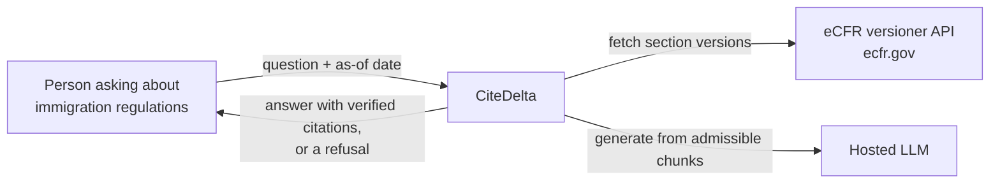
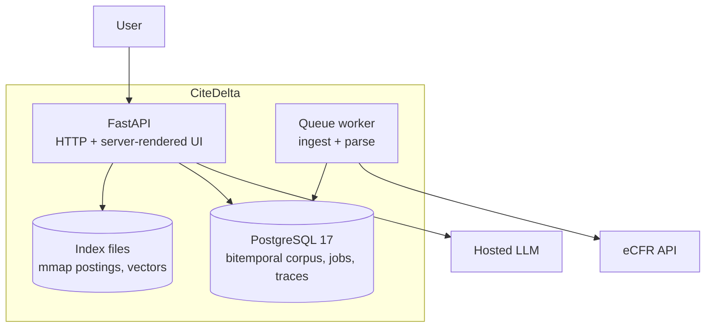
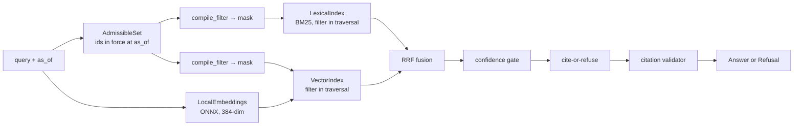
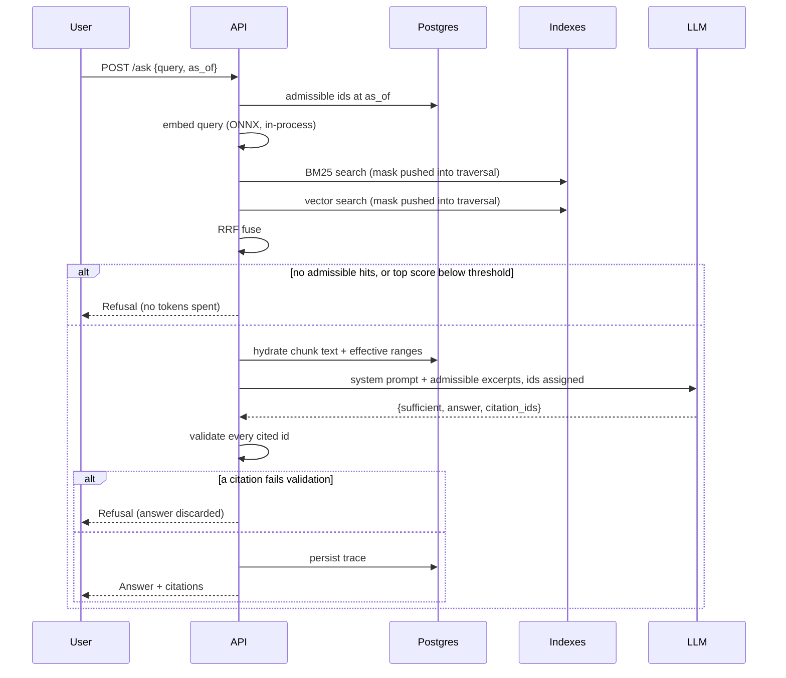

# 02 — Diagrams

## Level 1 — Context

## Level 2 — Containers

## Level 3 — The retrieval path

## Sequence — one question

The `alt` branches are the point: the happy path alone describes a demo. The
refusal branches are where the design lives — the confidence gate keeps tokens
unspent, and the citation validator guarantees every cited id is one of the
admissible chunks actually shown to the model.
