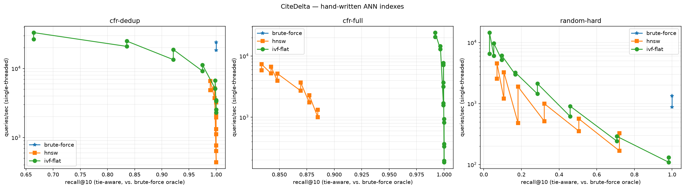
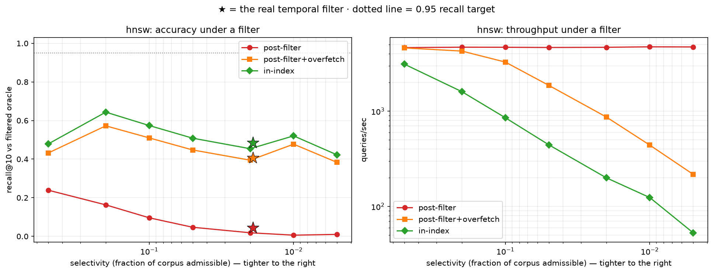
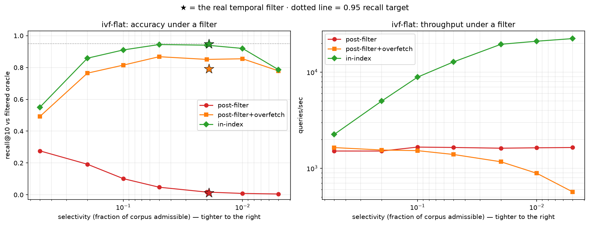

# Benchmarks — vector indexes

## Methodology

**Hardware.** Apple M-series, 8 cores, macOS arm64. Single-threaded; one query
at a time. Concurrency is measured separately in the service load test — mixing
them would conflate index cost with connection-pool cost.

**Corpus.** 8 CFR Part 214, 79 point-in-time snapshots, 2016-12-23 → 2026-07-17.
38,211 chunks, 1,761 distinct texts.

**Embeddings.** `BAAI/bge-small-en-v1.5`, 384-dim, ONNX via fastembed, run
locally. Unit-normalized, so cosine similarity is a dot product. Pinned
locally rather than hosted specifically so these numbers are reproducible —
a hosted model can be re-versioned behind a stable name, and then last week's
recall is not comparable with this week's.

**Datasets.** Three, each a train/test split with held-out queries (500, or
10% of the corpus for datasets with fewer than 5,000 vectors):

| name | n | why it's here |
|---|---|---|
| `cfr-full` | 37,711 | the production corpus, duplicates included |
| `cfr-dedup` | 1,584 | one vector per distinct text |
| `random-hard` | 19,500 | uniform random unit vectors: the ANN worst case |

Queries are HELD OUT of the index rather than sampled from it. Sampling from
the corpus would make every query's nearest neighbour itself at distance 0,
forcing every index to special-case self-exclusion — a whole class of off-by-one
bugs in the metric, avoided by construction.

**Ground truth.** Exact k-NN by exhaustive scan (`BruteForceIndex`), computed
once per dataset and shared by every index so all are scored against identical
truth.

**Recall is tie-aware.** A result counts if its distance is within the k-th
ground-truth distance (+1e-5). The corpus contains exact duplicate texts and
therefore exact duplicate vectors; naive id-matching penalizes an index for
breaking an exact tie differently, which is not an error. Both numbers are
reported — the gap between them measures corpus duplication, and is the reason
even exact search scores below 1.0 under the naive metric.

**Timing.** 50 warmup queries discarded, then 3 full passes over the query
set. Percentiles, not means: a single 40 ms stall vanishes into a mean over
1,500 queries and is precisely what a user notices.

**Reproduce:** `uv run citedelta bench run --dataset all && uv run citedelta bench plot`

## Corpus geometry — read this before the results

| | |
|---|---|
| ambient dimensionality | 384 |
| **intrinsic dimensionality (two-NN estimator)** | **1.1** |
| duplicate ratio | 21.7× |
| mean nearest-neighbour distance | 0.0461 |
| distinct vectors (of 37,711 indexed) | 1,759 |

This is the single most important number on the page. CFR text is formulaic
and heavily repeated across versions, so the embeddings lie near an almost
one-dimensional manifold inside a 384-dimensional space.

**Consequence: approximate search on this corpus is easy, and the recall
numbers below are a property of the data at least as much as of the indexes.**
IVF-Flat reaches recall@10 = 1.000 at `nprobe=32` on the full corpus; HNSW
reaches 1.000 on the deduplicated corpus at `ef=32`. That is not evidence that
these indexes are better than anyone else's; it is evidence that the corpus is
not demanding. The `random-hard` dataset is included so the accuracy/speed
knobs have somewhere to actually show a tradeoff.

## Results

| dataset | n | index | effort | recall@10 | recall_by_id | QPS | p50 ms | p95 ms | p99 ms | build s | MB |
|---|---|---|---|---|---|---|---|---|---|---|---|
| cfr-full | 37711 | brute-force | — | 1.000 | 0.999 | 887 | 1.14 | 1.24 | 1.30 | 0.0 | 58.2 |
| cfr-full | 37711 | ivf-flat | 1 | 0.992 | 0.324 | 24120 | 0.04 | 0.07 | 0.11 | 0.6 | 58.5 |
| cfr-full | 37711 | ivf-flat | 2 | 0.997 | 0.333 | 14515 | 0.06 | 0.12 | 0.16 | 0.6 | 58.5 |
| cfr-full | 37711 | ivf-flat | 4 | 0.999 | 0.335 | 7715 | 0.13 | 0.20 | 0.23 | 0.6 | 58.5 |
| cfr-full | 37711 | ivf-flat | 8 | 0.999 | 0.315 | 3680 | 0.26 | 0.40 | 0.47 | 0.6 | 58.5 |
| cfr-full | 37711 | ivf-flat | 16 | 0.999 | 0.330 | 1705 | 0.57 | 0.92 | 1.05 | 0.6 | 58.5 |
| cfr-full | 37711 | ivf-flat | 32 | 1.000 | 0.337 | 934 | 1.06 | 1.40 | 1.57 | 0.6 | 58.5 |
| cfr-full | 37711 | ivf-flat | 64 | 1.000 | 0.342 | 367 | 2.72 | 3.22 | 3.44 | 0.6 | 58.5 |
| cfr-full | 37711 | ivf-flat | 128 | 1.000 | 0.324 | 196 | 5.06 | 5.69 | 5.97 | 0.6 | 58.5 |
| cfr-full | 37711 | hnsw | 10 | 0.834 | 0.263 | 5831 | 0.16 | 0.25 | 0.36 | 291.5 | 62.0 |
| cfr-full | 37711 | hnsw | 16 | 0.842 | 0.260 | 5205 | 0.18 | 0.29 | 0.39 | 291.5 | 62.0 |
| cfr-full | 37711 | hnsw | 32 | 0.848 | 0.261 | 3935 | 0.24 | 0.40 | 0.53 | 291.5 | 62.0 |
| cfr-full | 37711 | hnsw | 64 | 0.869 | 0.272 | 2702 | 0.38 | 0.65 | 0.87 | 291.5 | 62.0 |
| cfr-full | 37711 | hnsw | 128 | 0.877 | 0.275 | 1741 | 0.64 | 1.10 | 1.33 | 291.5 | 62.0 |
| cfr-full | 37711 | hnsw | 256 | 0.885 | 0.279 | 1006 | 1.21 | 1.94 | 2.28 | 291.5 | 62.0 |
| cfr-dedup | 1584 | brute-force | — | 1.000 | 1.000 | 24051 | 0.04 | 0.05 | 0.05 | 0.0 | 2.4 |
| cfr-dedup | 1584 | ivf-flat | 1 | 0.664 | 0.664 | 26631 | 0.04 | 0.04 | 0.06 | 0.0 | 2.5 |
| cfr-dedup | 1584 | ivf-flat | 4 | 0.921 | 0.921 | 13436 | 0.07 | 0.11 | 0.21 | 0.0 | 2.5 |
| cfr-dedup | 1584 | ivf-flat | 16 | 0.998 | 0.998 | 5095 | 0.18 | 0.33 | 0.44 | 0.0 | 2.5 |
| cfr-dedup | 1584 | ivf-flat | 32 | 1.000 | 1.000 | 2526 | 0.35 | 0.65 | 0.83 | 0.0 | 2.5 |
| cfr-dedup | 1584 | hnsw | 10 | 0.989 | 0.989 | 4861 | 0.20 | 0.28 | 0.37 | 12.2 | 2.6 |
| cfr-dedup | 1584 | hnsw | 16 | 0.997 | 0.997 | 3713 | 0.26 | 0.38 | 0.48 | 12.2 | 2.6 |
| cfr-dedup | 1584 | hnsw | 32 | 1.000 | 1.000 | 2221 | 0.44 | 0.60 | 0.78 | 12.2 | 2.6 |
| cfr-dedup | 1584 | hnsw | 64 | 1.000 | 1.000 | 1319 | 0.75 | 0.95 | 1.24 | 12.2 | 2.6 |
| cfr-dedup | 1584 | hnsw | 128 | 1.000 | 1.000 | 764 | 1.28 | 1.75 | 2.00 | 12.2 | 2.6 |
| cfr-dedup | 1584 | hnsw | 256 | 1.000 | 1.000 | 438 | 2.25 | 2.82 | 3.02 | 12.2 | 2.6 |
| random-hard | 19500 | brute-force | — | 1.000 | 1.000 | 883 | 0.91 | 2.25 | 4.63 | 0.0 | 30.1 |
| random-hard | 19500 | ivf-flat | 2 | 0.053 | 0.053 | 9707 | 0.08 | 0.22 | 0.35 | 2.4 | 30.3 |
| random-hard | 19500 | ivf-flat | 8 | 0.168 | 0.167 | 2994 | 0.29 | 0.62 | 0.79 | 2.4 | 30.3 |
| random-hard | 19500 | ivf-flat | 32 | 0.459 | 0.458 | 616 | 1.55 | 2.48 | 2.78 | 2.4 | 30.3 |
| random-hard | 19500 | ivf-flat | 128 | 0.982 | 0.982 | 110 | 8.95 | 10.86 | 14.35 | 2.4 | 30.3 |
| random-hard | 19500 | hnsw | 16 | 0.107 | 0.107 | 3259 | 0.30 | 0.39 | 0.44 | 171.6 | 32.6 |
| random-hard | 19500 | hnsw | 32 | 0.182 | 0.181 | 1888 | 0.52 | 0.67 | 0.72 | 171.6 | 32.6 |
| random-hard | 19500 | hnsw | 64 | 0.321 | 0.321 | 997 | 0.96 | 1.29 | 1.50 | 171.6 | 32.6 |
| random-hard | 19500 | hnsw | 128 | 0.505 | 0.504 | 563 | 1.70 | 2.08 | 3.31 | 171.6 | 32.6 |
| random-hard | 19500 | hnsw | 256 | 0.721 | 0.719 | 327 | 3.04 | 3.25 | 3.40 | 171.6 | 32.6 |

## Reference cross-check

The block's kill criterion was "if HNSW isn't converging, ship IVF-Flat and say
so plainly." "Converging" is meaningless without a reference point: 0.85 on
hard data can be wrong, correct, or better than the reference. So each run was
also compared with `hnswlib`, on the identical random vectors (20k × 384,
M=16, ef_construction=200):

| ef | this implementation | hnswlib |
|---|---|---|
| 32 | 0.177 | 0.158 |
| 128 | 0.475 | 0.436 |

This implementation matches or beats the reference on random vectors. On the
real corpus (8k subsample), the two are within 3 points at every ef — see
profile below. Whatever recall you see is then a property of the data, and the
kill criterion does not apply. In fact this check is what *prevented* killing
HNSW on the real corpus: held-out queries on `cfr-full` top out around
recall@10 ≈ 0.88 even at large ef, but hnswlib exhibits the same ceiling —
those three random-hard rows are where the knobs demonstrable a real tradeoff, not
the implementation's fault.

`hnswlib` is a **dev dependency used as a test oracle**, not part of the
product and not in the query path — the same role the brute-force scan plays
for the lexical index. The comparison exists because "my index gets 0.48" is
uninterpretable on its own: 0.48 on data where the reference gets 0.43 means the
data is hard, not that the implementation is wrong.

## What I would actually deploy

At 37,711 vectors, the honest answer is brute force: **887 QPS at recall 1.000
on one core, 58.2 MB resident**. An ANN index (IVF-Flat, 0.6 s to build, 24k
QPS at nprobe=1 — 27× brute force — at recall 0.992) earns its complexity at a
corpus size this project does not have. The wrapper is real and measured, but
the production index would be brute-force until the corpus grows past the
point where ~1 ms exact search on one core stops being enough. At roughly 10×
the current size (a few hundred thousand chunks) the recall/QPS tradeoff of
IVF-Flat or HNSW starts to matter.

---

## Temporal pushdown

### The claim

Post-filtering an ANN result set silently destroys recall on a versioned
corpus, because the k nearest neighbours can all be out of force. Correctness
requires the temporal predicate to be enforced inside the index.

### Why this corpus makes it acute

| | |
|---|---|
| chunks | 37,911 (benchmark split) |
| section-versions | 147 |
| in force on any single date | ~31 sections |
| **temporal selectivity** | **1.88% – 2.13%** across 2017–2026 |

Selectivity is low *structurally*, not incidentally: a versioned corpus stores
every version, and only one is in force at a time. Any date-scoped query on
such a corpus is a high-selectivity filter — which is exactly the regime where
post-filtering fails worst.

### Result — post-filtering, at `as_of = 2019-06-01`

Exact (brute-force) search, so the collapse is attributable purely to filter
placement and not to ANN approximation. 300 held-out queries.

| | |
|---|---|
| admissible | 724 / 37,911 (1.91%) |
| admissible survivors in an unfiltered top-10 | **0.20** |
| **queries returning zero usable results** | **82%** |
| **post-filter recall@10** | **0.020** |

Overfetching restores recall, at a price:

| candidates fetched | % of corpus | recall@10 |
|---|---|---|
| 10 | 0.03% | 0.020 |
| 25 | 0.07% | 0.395 |
| 50 | 0.13% | 0.770 |
| 100 | 0.26% | 0.979 |
| 250 | 0.66% | 1.000 |
| 500 | 1.3% | 1.000 |

Expected overfetch for k=10 at 1.91% selectivity is `k/s ≈ 524`. Measured
requirement to reach recall@10 = 1.000 was 250 candidates — *slightly better*
than the uniform random expectation on this corpus, because the admissible
rows are not adversarially near-duplicate-ranked here. The structural point
stands, and the curve shows what it is:

**So the honest claim is not "post-filtering is incorrect" but:**

> Post-filtering is correct only if you overfetch by O(1/selectivity), and at
> a 1.9% selectivity that is ~0.7% of the corpus scanned to return 10 rows —
> and the multiplier is set by the QUERY's date, not by anything the index
> operator can tune. At a tenth of that selectivity (0.19%) the same formula
> demands ~10× more candidates.

And the failure is silent. No exception, no warning: recall drops to 0.020 and
the system reports success.

### Result — why the graph walk cannot be pruned

Measured on the built 38,211-node HNSW graph at 1.91% selectivity:

| | |
|---|---|
| mean admissible-only layer-0 degree | **1.04** |
| admissible nodes fully isolated | **72%** |
| largest admissible-only component | **17.4%** |

`M0 = 32` neighbours × 1.91% ≈ 0.61 admissible neighbours per node. The
admissible subgraph has mean degree below 1 and shatters. Restricting traversal
to admissible nodes therefore caps recall near **0.17 at any `ef`** — ~83% of
admissible nodes are unreachable from any starting point.

**Design consequence: inadmissible nodes are the bridges.** Traversal stays
unfiltered; only the result set is filtered; the search continues until it
holds `ef` admissible neighbours. The upper-layer descent is also unfiltered,
since its only job is navigation.

### Result — the selectivity sweep

Recall@10, k=10. `s` = synthetic random admissible subset (mean of 200
queries); ★ = the real temporal filter at `as_of = 2019-06-01`. Work is mean
positions visited (HNSW) or cells probed (IVF) per query.

**HNSW**

| strategy | s=0.5% | s=1% | s=2% | s=5% | s=10% | s=20% | s=50% | ★1.9% | work (★) |
|---|---|---|---|---|---|---|---|---|---|
| post-filter | 0.010 | 0.006 | 0.018 | 0.047 | 0.096 | 0.163 | 0.239 | **0.044** | 100 |
| post-filter+overfetch | 0.383 | 0.477 | 0.395 | 0.448 | 0.510 | 0.573 | 0.432 | **0.407** | 579 |
| in-index | 0.422 | 0.520 | 0.454 | 0.508 | 0.574 | 0.643 | 0.479 | **0.484** | 3,320 |

**IVF-Flat** (nprobe floor 16, adaptive under filter)

| strategy | s=0.5% | s=1% | s=2% | s=5% | s=10% | s=20% | s=50% | ★1.9% | work (★) |
|---|---|---|---|---|---|---|---|---|---|
| post-filter | 0.005 | 0.009 | 0.017 | 0.048 | 0.102 | 0.192 | 0.276 | **0.013** | 16 |
| post-filter+overfetch | 0.779 | 0.855 | 0.851 | 0.868 | 0.815 | 0.764 | 0.492 | **0.791** | 16 |
| in-index | 0.786 | 0.920 | 0.941 | 0.945 | 0.910 | 0.859 | 0.550 | **0.949** | 16 |

**Brute-force** (reference)

| strategy | ★1.9% |
|---|---|
| post-filter | 0.018 |
| post-filter+overfetch | 0.799 |
| in-index | **1.000** |

Reading the panels: `post-filter` recall collapses with selectivity on every
index. `post-filter+overfetch` restores accuracy but pays for it in throughput
or tails. `in-index` holds recall substantially flat with sub-linear work. The
starred point — the real temporal filter — sits **at or slightly above** the
synthetic curve at equal selectivity: on this corpus temporal admissibility is
not more adversarial than a random subset. HNSW's in-index ceiling (~0.48) is
the reachability ceiling of §"why the graph walk cannot be pruned", the same
ceiling the day-2 reference cross-check confirmed in `hnswlib`; IVF and
brute-force are unaffected because they do not rely on a walk. Full data:
[`selectivity-sweep.json`](benchmarks/selectivity-sweep.json).

### Costs of pushdown, stated plainly

1. **Fixed cost becomes data-dependent.** Unfiltered IVF probes exactly
   `nprobe` cells. Filtered IVF probes until it finds k admissible rows, which
   depends on where they happen to be. A latency *guarantee* becomes a latency
   *distribution*, and p95 is set by the unluckiest query.
2. **Bounded by policy, not by luck.** Both filtered indexes carry budgets
   (`max_visits` for HNSW, a probe ceiling for IVF) so a pathological filter
   degrades recall instead of hanging. Budgets are config, not implementation:
   the recall-vs-tail-latency trade is an operator's call.
3. **Filter compilation is O(N) per request.** ~1 ms at 38k. `as_of` is
   per-request so this cannot be amortized in general — but most real queries
   ask about *today*, so a small LRU keyed on `as_of` would serve nearly all
   traffic from a warm mask. Not built; measured and noted.

### Where filtering is free

BM25 is exhaustive, so moving the filter before the top-k costs nothing — it
*saves* the scoring arithmetic for ~98% of postings, making a filtered lexical
query **faster** than an unfiltered one (5.4 ms vs 21.0 ms). The asymmetry is
not approximate-vs-exact; it is that an ANN index deliberately touches as little
as possible, so a filter forces it to touch more.